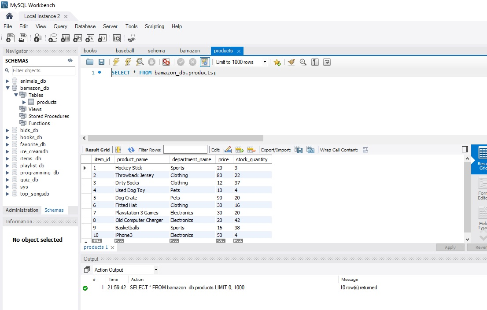
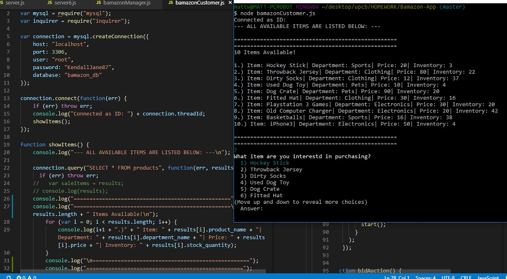
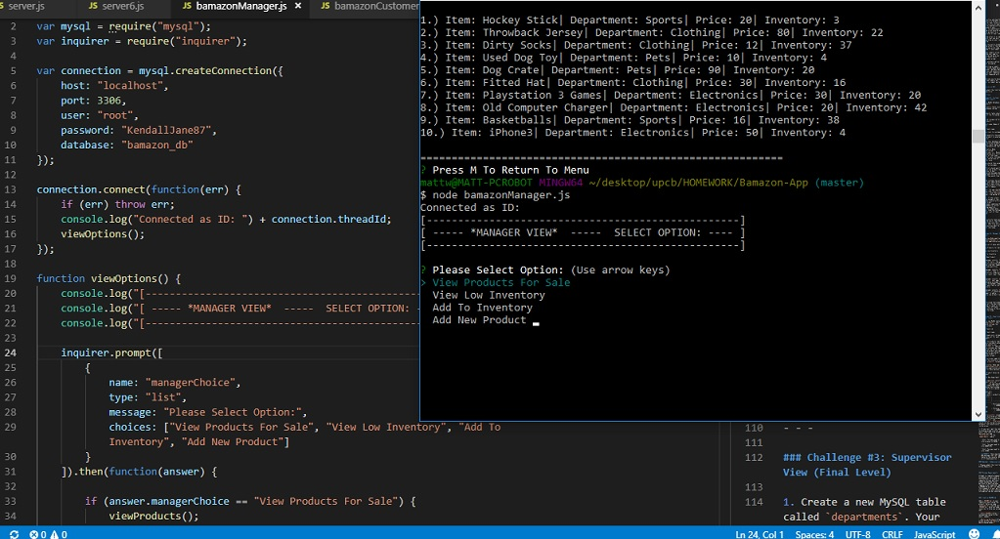
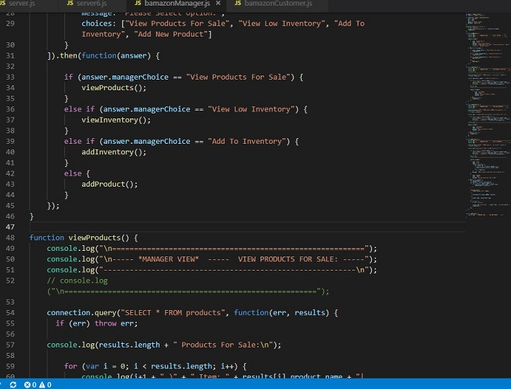
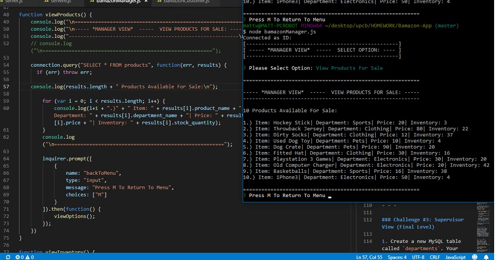
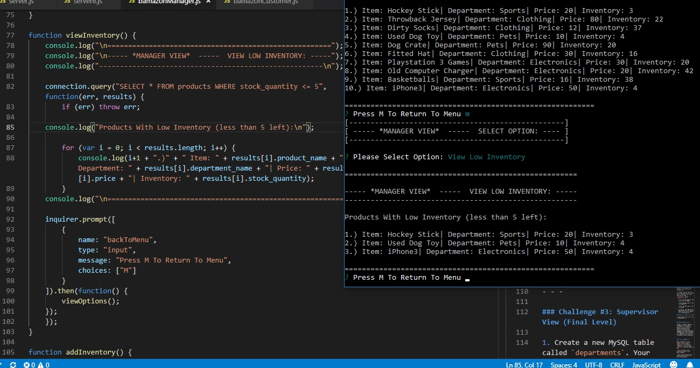
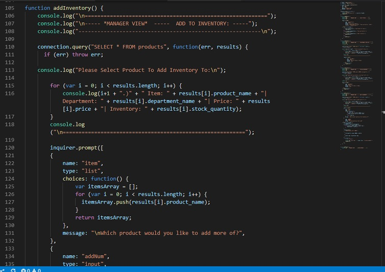
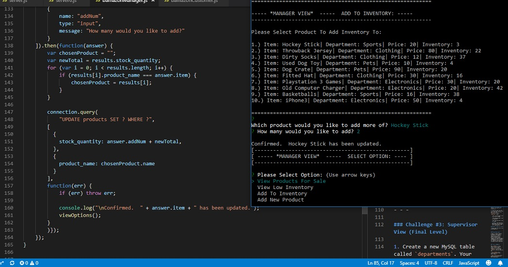

# 'Bamazon' Online Node JS Store Application
___

The main goal of this project was to creating a storefront type application, loosely based off of Amazon, that would be run from the terminal using Node JS, and linked to a MySQL database.  When the user opens the app they are able to see the current inventory of the database, and then can place an order for a specific item.  From there, the stock quantity of the item will also be deducted from the database, and if no more items are available, the user will be notified.  Screenshots of the SQL database is found below:
___

___

Screenshots for the JavaScript code and Node terminal store are found below as well, and after past activities, this part of the project was not that difficult.  The majority of bugs I encountered were found when making sure that the correct callback functions were inside the correct parent functions so that everything would go smoothly.  I had sat with two colleagues briefly and was able to get everything in order.
___

___
.jpg)
___
.jpg)
___
.jpg)
___
.jpg)
___

That was the first part of the project, with optional bonus level options to be added after.  The additions were another JavaScript file for a Manager-Mode of the bamazon terminal store, and the manager would be able to view all the products for sale, view the products with a low inventory (under 5) with a simple search, add to any product inventory (stock quantity), and add new products to the database.  Creating the 'view products for sale' and 'view low inventory' options was able to be done without too many issues, and going back to the bamazonCustomer.js code, as well as past activities such as the GreatBay and topSongs definitely helped out as well.  I was able to also get the 'add to inventory' part of the project working, however, I will still need to figure out why the stock inventory was not being added to the stock in the database.  For the last function, the 'add new product' function is working fine, where the Manager is able to add a new product, along with its price, department, and number of the product in the inventory to the original SQL database.  Lastly, the only bugs that were still lingerling was with the 'add to inventory' function as I mentioned before, but I'm sure with a little more fine tuning it will be up and running (however I am running out of time here).  Screenshots are found below, and more time will be put into the remaining function to get it working.
___

___

___

___

___

___

___
.jpg)
___
.jpg)
___

Lastly, two new variables were created that were trying to add the input of the new inventory to the database of the product name, however, both of those variables did not update the new total in the database.  This project needed to be submitted, and in the future I will go back to finish all aspects of the project.  Screenshots of the update is below:
___
.jpg)
___

## Built With

* [Node JS]
* [MySQL]
* [JavaScript]

## Authors

* **Matt Williams** - *Initial work* - [M Williams Portfolio](https://mattwills09.github.io/portfolio.html)
